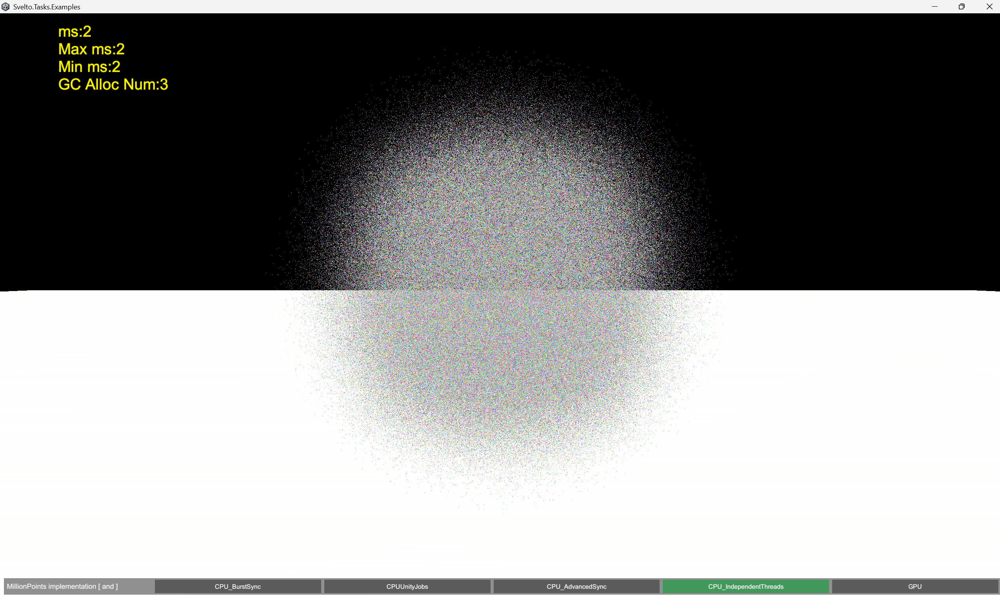
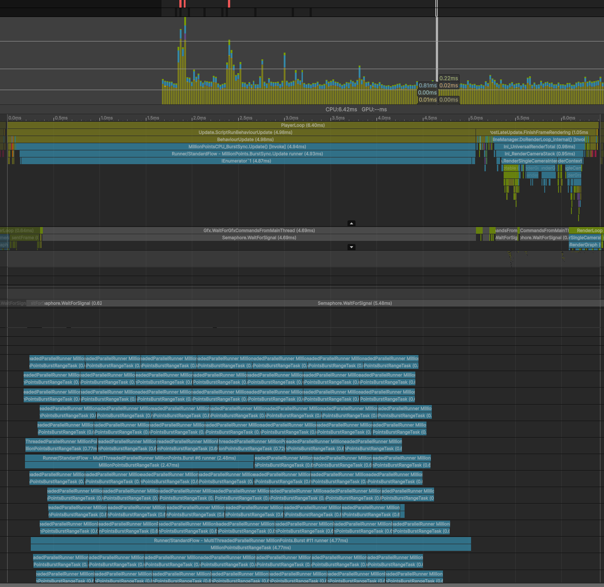
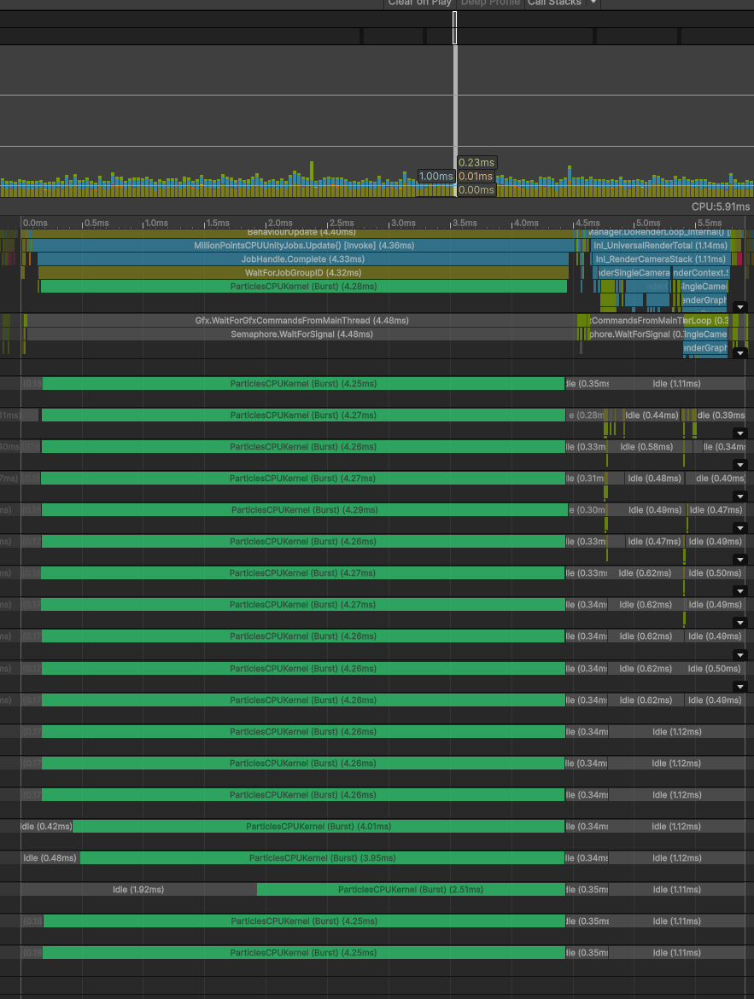
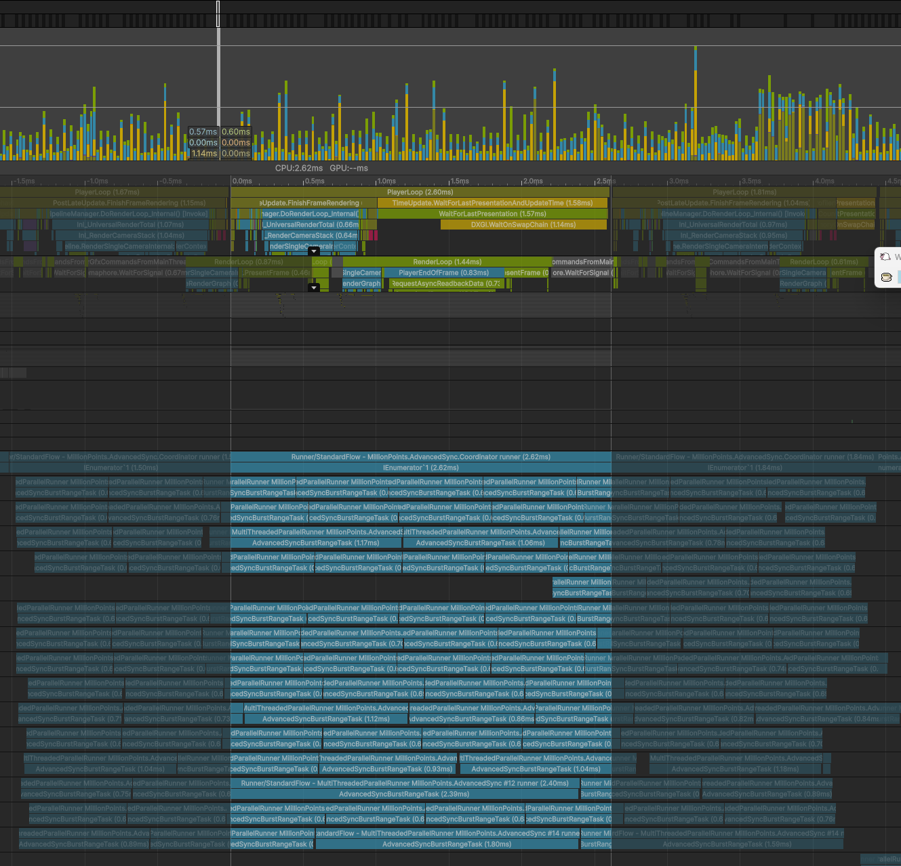
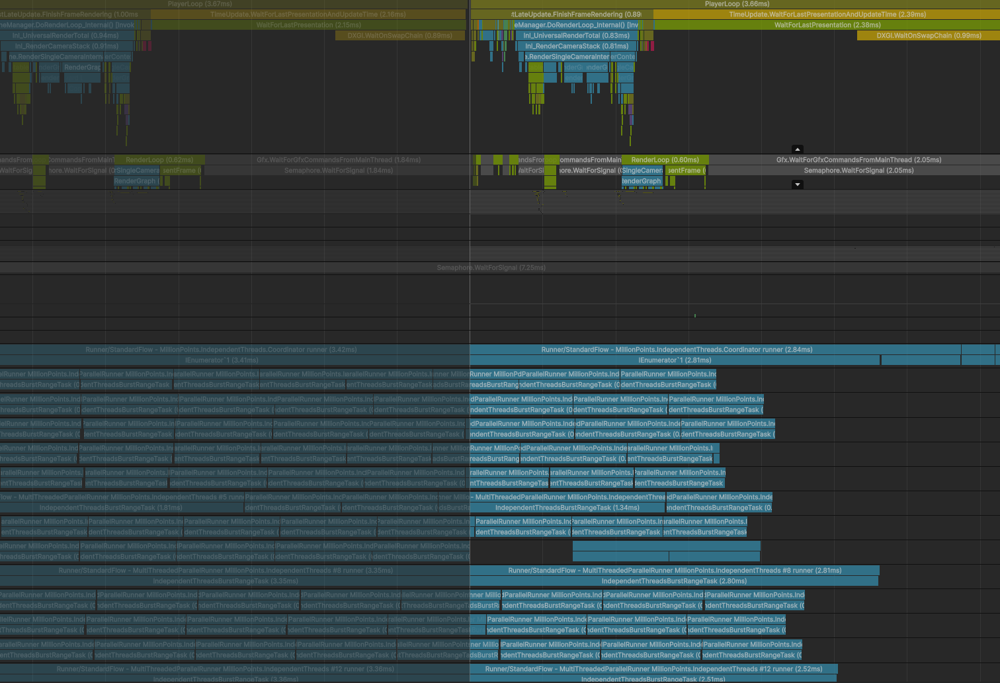
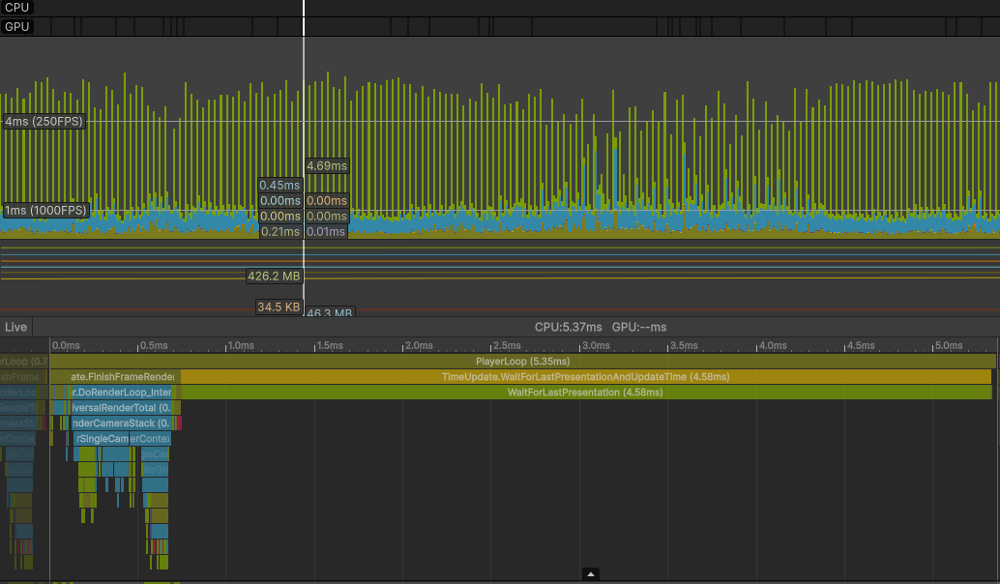
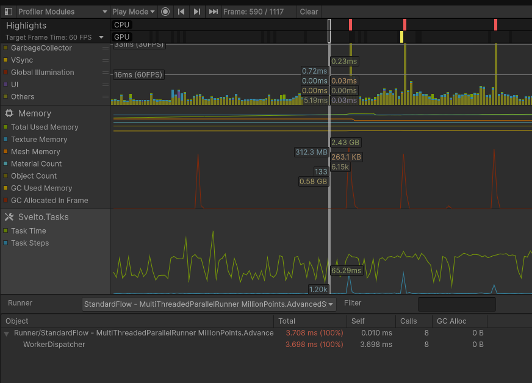

# Svelto.Tasks.Examples

Unity project containing the examples for [Svelto.Tasks](https://github.com/sebas77/Svelto.Tasks)
(work in progress for Svelto.Tasks 2.0). The Svelto.Tasks and Svelto.Common packages are
embedded in `Packages/` so the examples always run against the package source in this
repository.

## Requirements

- Unity **6000.5** or newer (project built with 6000.5.9f1) with the **Universal Render Pipeline**
- Packages (already referenced by `Packages/manifest.json`):
  - `com.sebaslab.svelto.tasks` 2.0.0-preview.2 (embedded)
  - `com.sebaslab.svelto.common` 3.6.0 (embedded)
  - `com.unity.burst`, `com.unity.collections`, `com.unity.render-pipelines.universal`

## Running the examples

Run `Assets/Startup/Startup.unity`. It is the first enabled Build Settings
scene and presents every other enabled scene as a selectable example.

## MillionPoints

`Assets/MillionPoints/MillionPoints.unity` simulates **1,000,000 particles per frame**
and lets you switch at runtime between five implementations of the same simulation:

| # | Component | Strategy |
| --- | --- | --- |
| 0 | `MillionPointsCPU_BurstSync` | Svelto.Tasks baseline: the main thread maps a GPU upload region (`ComputeBufferMode.SubUpdates`), Burst range tasks write into it, then the main thread closes the write and renders. Two buffers alternate, each guarded by its own `GraphicsFence`. |
| 1 | `MillionPointsCPUUnityJobs` | Unity Jobs version maintained for comparison. Same double-buffer + fence pattern; skips the frame upload while the next slot's fence is pending. |
| 2 | `MillionPointsCPU_AdvancedSync` | Signal-gated strategy: `BeginWrite`/`EndWrite` stay on the main thread and are gated by a three-signal handshake while Burst workers fill the mapped region from a coordinator thread. |
| 3 | `MillionPointsCPU_IndependentThreads` | Independent runners: a reusable main-thread task opens a fence-safe mapped slot, background Burst tasks write into it directly, and the render task closes completed writes and draws the latest published slot. |
| 4 | `MillionPointsGPU` | Pure compute-shader reference implementation (the GPU is the right tool for this job; the CPU cases exist to demonstrate Svelto.Tasks). |

Switch implementations with the on-screen buttons or the `[` and `]` keys.
Switching disables the previous component first, so its `OnDisable` cleanup is
part of the test.



The in-scene profiler HUD (top-left) samples frame time and GC collections;
with the `BENCHMARK` scripting define it also reports the particle count.

### CPU upload fence ownership

All four CPU implementations write particle data every frame through two
`ComputeBufferMode.SubUpdates` upload buffers. Each slot owns its latest
graphics fence:

```text
write slot 0 -> draw slot 0 -> fence 0
write slot 1 -> draw slot 1 -> fence 1
reuse slot 0 only after fence 0 passes
```

`GraphicsFenceType.CPUSynchronisation` is used: the CPU polls GPU completion
before mapping a previously rendered slot again.

### Profiler captures

Deep profiles of the five implementations (`Captures/`):

| Implementation | Capture |
| --- | --- |
| `MillionPointsCPU_BurstSync` |  |
| `MillionPointsCPUUnityJobs` |  |
| `MillionPointsCPU_AdvancedSync` |  |
| `MillionPointsCPU_IndependentThreads` |  |
| `MillionPointsGPU` |  |

## Profiling Svelto.Tasks

Svelto.Tasks integrates with the Unity Profiler through a dedicated
**Svelto.Tasks** module showing *Task Time* and *Task Steps* graphs plus a
per-runner breakdown (total/self time, calls and GC allocations):



## Verifying the examples

The MillionPoints scene keeps every implementation on one GameObject; entering
Play mode alone does not prove which one ran. `RuntimeImplementationSelector`
enables exactly one implementation at a time. The manual verification procedure
(fence errors, cleanup checks, MCP caveats) is documented in
[`Assets/MillionPoints/TESTING.md`](Assets/MillionPoints/TESTING.md).